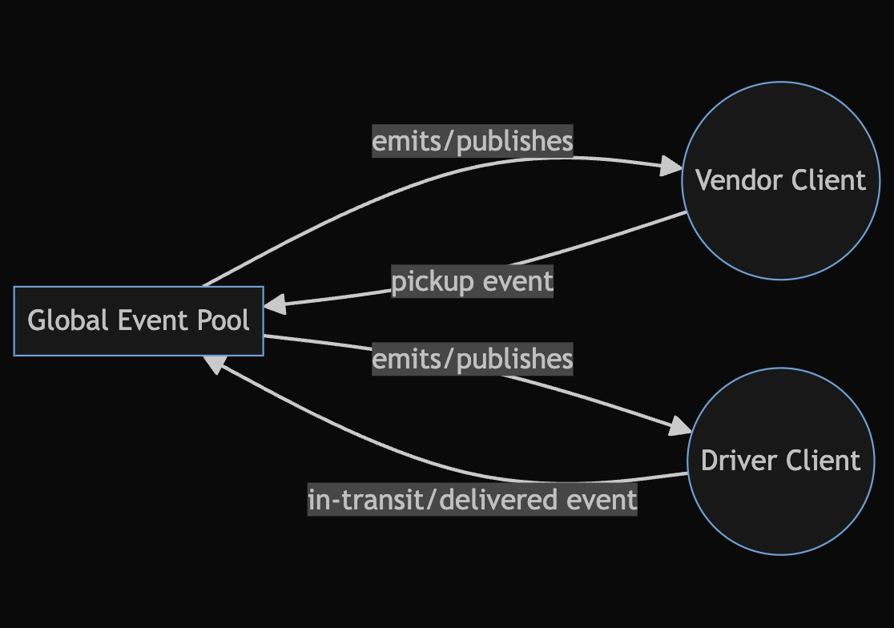

# LAB - Class 11

## Project: Caps

### Author: Bryan O. Garduno Gonzalez

### Problem Domain

The CAPS (Courier, Airline, Parcel, and Shipment) system, now in its Phase 2, has evolved into a networked, event-driven application simulating a package delivery process. The core functionality remains focused on managing package states (pickup, in-transit, and delivered) and facilitating real-time communication between vendors and drivers. In this phase, the application employs Socket.io to create a network event-driven system, enabling real-time, bi-directional communication between web clients and servers.

### Links and Resources

- [GitHub Actions ci/cd](https://github.com/brosmar18/Caps/actions) 
- Dev [Back-end server Dev Branch url]()
- Main [back-end server main branch url]()

### Collaborators

- **ChatGPT by OpenAI**: Used as a programming partner for brainstorming ideas, debugging code, formulating tests, and drafting documentation. ChatGPT's contributions were invaluable in enhancing the efficiency and quality of the development process.

### Setup

#### `.env` requirements (where applicable)

A .env file is included in local repository. A .env-sample file is uploaded to the remote repo so collaborators understand what environmental variables are being used. 

#### How to initialize/run your application (where applicable)

- e.g. `npm start`

#### How to use your library (where applicable)

## Features

- **Networked Event-Driven Architecture**: Leveraging Socket.io, the CAPS system now supports real-time, networked communication. This upgrade allows for more dynamic and efficient interactions between vendors, drivers, and the server.

- **Socket.io Implementation**: The system utilizes Socket.io to manage connections on a namespace called 'caps', enabling seamless event handling and broadcasting to specific clients.

- **Vendor Client Application**: 
  - Enhanced Order Processing: Vendors emit 'pickup' events to the Socket.io server, which are then broadcast to drivers.
  - Real-Time Delivery Confirmation: Vendors listen for 'delivered' events from drivers and acknowledge deliveries in real-time.

- **Driver Client Application**: 
  - Networked Order Handling: Drivers receive 'pickup' events from the Socket.io server and process orders by emitting 'in-transit' and 'delivered' events back to the server.
  - Real-time Order Updates: Drivers continuously update the system about the order status, enhancing the tracking and management of deliveries.

- **Robust Logging System**: The server logs all events with timestamps and payload details, offering greater transparency and traceability of package movements.

- **Unit Testing**: Comprehensive unit tests ensure the reliability and correctness of the Socket.io event handling and business logic in both vendor and driver modules.

#### Tests

The CAPS project, now integrated with Socket.io, includes updated unit tests to ensure the functionality and reliability of its networked event handlers.

##### Vendor Event Handling
Tests focus on vendor functionalities such as order creation, event emission to the server, and handling of real-time delivery confirmations.

##### Driver Event Handling
These tests cover the driver's response to networked events, including the reception of order pickups, processing of deliveries, and communication of status updates to the server.

### Running the Tests:

To run the updated tests for the CAPS project with Socket.io integration, use the command:

`npm test`

### Incomplete or Skipped Tests:

All critical functionalities of the CAPS project are thoroughly tested. The test suite provides comprehensive coverage, ensuring the system operates reliably with its new networked event-driven architecture.

#### UML

;
