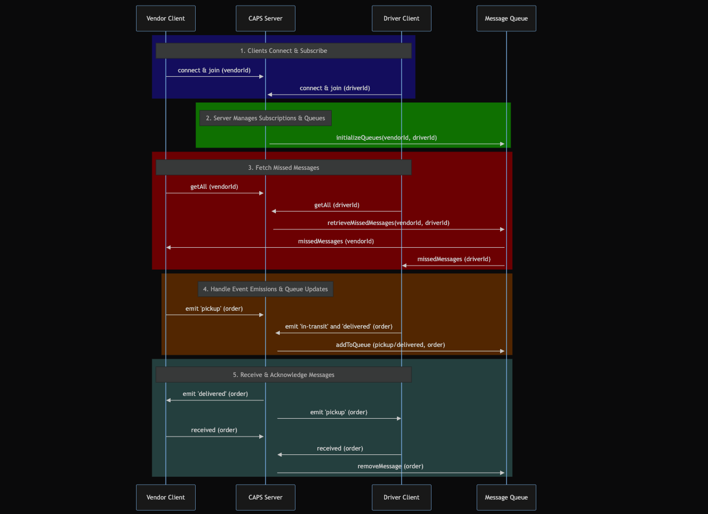

# LAB - Class 13

## Project: Caps

### Author: Bryan O. Garduno Gonzalez

### Problem Domain

In Phase 3, CAPS (Courier, Airline, Parcel, and Shipment) evolves into a sophisticated, real-time package delivery management system. This phase introduces a robust queueing mechanism on the server side, ensuring every package event from pickup to delivery is reliably communicated to and acknowledged by vendors and drivers, even in their absence. With an emphasis on guaranteed delivery of notifications and the ability to catch up on missed messages, CAPS Phase 3 enhances the communication pipeline, ensuring vendors and drivers are always in sync with the delivery process.

### Links and Resources

- [GitHub Actions ci/cd](https://github.com/brosmar18/Caps/actions) 
- Dev [Back-end server Dev Branch url]()
- Main [back-end server main branch url]()

### Collaborators

- **ChatGPT by OpenAI**: Used as a programming partner for brainstorming ideas, debugging code, formulating tests, and drafting documentation. ChatGPT's contributions were invaluable in enhancing the efficiency and quality of the development process.

### Setup

#### `.env` requirements (where applicable)

A .env file is included in local repository. A .env-sample file is uploaded to the remote repo so collaborators understand what environmental variables are being used. 

#### How to initialize/run your application (where applicable)

- e.g. `npm start`

#### How to use your library (where applicable)

## Features

- **Message Queue System**: CAPS now includes a server-side queueing mechanism, categorizing and storing events for each client. This feature ensures no event is lost and clients can retrieve missed messages.
- **Reliable Notification Delivery**: Vendors and drivers receive real-time notifications for package events. In case they are offline, the system stores these notifications for later retrieval.
- **Event Acknowledgement**: Clients send back an acknowledgement upon receiving a message, ensuring the server can safely remove the message from the queue.
- **Catch-up Mechanism**: Both vendors and drivers can request all undelivered messages upon reconnecting, ensuring they are up-to-date with all events.
- **Refined Event Handling**: The server's event handlers are now equipped to manage adding messages to queues and broadcasting them to the appropriate clients.
- **Server-Side Tracking**: Every event and payload is tracked on the server side, adding an additional layer of reliability and traceability.

## Features

**STRETCH GOAL COMPLETED**

- **Message Queue System**: Introduces a server-side queue mechanism, ensuring that event notifications are managed and tracked efficiently, providing reliability in the communication process.
- **Reliable Delivery of Notifications**: Both vendors and drivers receive real-time notifications for package events. The system retains these notifications for offline clients, ensuring no information is missed.
- **Event Acknowledgement and Queue Management**: Clients acknowledge received messages, enabling the server to safely remove them from the queue, maintaining the integrity and relevance of the queue contents.
- **Catch-up Mechanism for Missed Messages**: Clients can request all undelivered messages, ensuring they're always updated with the latest events.
- **Enhanced Event Handling on Server**: Improved to manage adding messages to queues and broadcasting them efficiently to the appropriate clients.
- **Server-Side Event Tracking**: Adds a layer of reliability with logging every event and payload, enhancing traceability.
- **SocketClient Class Implementation (Stretch Goal)**: Abstracts socket.io-client functionality, with methods for connecting to the server, joining rooms, publishing events, and subscribing to them. This class enhances modularity and reusability across different client applications, allowing them to interact seamlessly with the server for event handling.

These features collectively enhance the CAPS system, making it a robust, reliable, and real-time package delivery management platform.

### Running the Tests:

To run the updated tests for the CAPS project with Socket.io integration, use the command:

`npm test`

### Incomplete or Skipped Tests:

All critical functionalities of the CAPS project are thoroughly tested. The test suite provides comprehensive coverage, ensuring the system operates reliably with its new networked event-driven architecture.

#### UML

;
